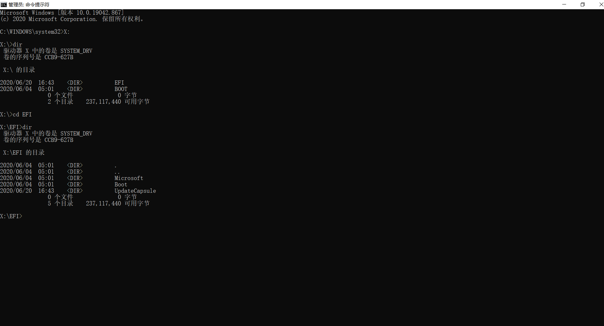

# LAB1

## 基本信息
- Author:钟书锐 
- Time:2021.4.9
---

## 实验环境
- VMware
- Ubuntu 20.04.1
- CPU型号名称: Intel(R) Core(TM) i7-10750H CPU @ 2.60GHz
- 虚拟化类型：完全
---

## kernel

- 首先配置好环境，然后进行裁剪
- 初始配置生成的Image在17MB左右
- delete ARM64 Accelerated Cryptographic Algorithms 
- delete Networking support
- select Compiler optimization level (Optimize for size (-Os))
- delete Support initial ramdisk/ramfs compressed using LZMA bzip2 XZ LZO LZ4 
- delete Security options 
- delete library routines 
- delete some of the filesystem
- 生成的Image在9MB左右,可以正常运行init 
- ***!!!kernel hacking -> trace can not be delete!!!***
- delete most device
- 生成的Image在5.5MB,可以正常运行init

## init
- mknod()创建设备文件
- execv()装入并运行其它程序
- fork()函数通过创建一个与原来进程几乎完全相同的进程

## boot
- make 执行
- .inc 包含文件 log__info控制输出 第一个参数控制字符串 第二个控制长度 第三个控制行数

#### 第一组问题
- Q: `xor ax, ax` 使用了异或操作 `xor`，这是在干什么？这么做有什么好处呢？
- A: `xor ax, ax`将ax置，相当于`mov ax, 0`，但是`xor`相比`mov`快因为`xor`只需要在cpu计算，后者需要访问内存（not sure）。同时，`mov ax, 0`对应的机器代码是`B8 00 00`， `xor ax, ax` 对应的机器代码`31 C0`，后者更短。xor置零寄存器只需要两个字节，mov则需要三个字节。
- Q: `jmp $` 又是在干什么？
- A：在汇编中 `$` 的作用是取 `$` 所在处的地址。所以`jmp $`就是一个死循环了。除非有中断，会转去执行中断服务程序。但要注意的是：返回的地址还是`jmp  $`，而不是其下一条语句。综上`jmp $`死循环等待中断然后执行。
- Q：`[es:di]` 是一个寻址操作，这是在寻址内存的哪个地址呢?
- A: 寄存器间接寻址，ES（Extra Segment）：附加段寄存器，DI（Destination Index）：目的变址寄存器，寻址内存的地址是由段地址左移4位，然后加上偏移地址形成。
- Q: `boot.asm` 文件前侧的 `org 0x7c00` 有什么用？
- A: boot.asm编译之后，存放于软盘映像的第一个扇区。BIOS会自动将其加载至0x7c00处，然后跳转至0x7c00开始执行代码。如果不使用org 0x7c00，则默认为从0x0100开始编址,加上地址偏移后的地址是错误的。
- Q: `times 510 - ($ - $$) db 0` 是在干什么？为什么要这么做呢？为什么这里有一个 `510`？
- A: `$`表示当前指令的地址，`$$`表示程序的起始地址(也就是`0X7c00`)，所以`$-$$`就等于本条指令之前的所有字节数。`510-($-$$)`的效果就是，填充了这些0之后，从程序开始到最后一个0，一共是510个字节。再加上最后的dw两个字节(0xaa55是结束标志)，整段程序的大小就是512个字节，刚好占满一个扇区。

#### 第二组问题
- Q: 尝试修改代码，在目前已有的输出中增加一行输出“I am OK!”，样式不限，位置不限，但不能覆盖其他的输出。
- A: 已完成

## Question
- Q: 请简要解释 `Linux` 与 `Ubuntu`、`Debian`、`ArchLinux`、`Fedora` 等之间的关系和区别
- A: `Linux`严格来说是一个操作系统的内核，严谨一些可以说：`linux` 一般指 GNU 套件加上 `linux`内核。`Ubuntu`、`Debian`、`ArchLinux`、`Fedora` 是linux的发行版。一个典型的Linux发行版包括：Linux内核，一些GNU程序库和工具，命令行shell，图形界面的X Window系统和相应的桌面环境。
- Q: 简述树莓派启动的各个阶段。
- A：启动流程：
- 1. 系统加电。
- 2. 加载系统芯片中的First stage bootloader。
- 3. First stage bootloader加载SD卡上bootcode.bin。
- 4. bootcode.bin执行,并加载第三阶段启动程序start.elf。
- 5. start.elf读取config.txt并加载内核。
- 6. config.txt解析完成,start.elf读取再次加载cmdline.txt文件，最后加载内核文件，然后CPU开始运行，系统启动成功。
- Q: 查阅 `PXE` 的资料，用自己的话描述它启动的过程。
- A: 预启动执行环境（Preboot eXecution Environment，PXE）也被称为预执行环境，提供了一种使用网络接口（Network Interface）启动计算机的机制。
- 1. PXE服务器搭建,PXE服务器主要提供两个服务，一个是DHCP，用于为需要PXE服务的主机提供IP；另一个是FTP服务，用于下载引导程序以及之后的系统。
- 2. 网络配置
- 3. 下载引导程序,例如通过FTP来进行下载操作
- 4. 启动引导程序
- Q: 查阅 `GRUB` 的资料，用自己的话描述它启动的过程。
- A:GRUBGRUB(Grand Unified Bootloader)，多系统启动程序。
- 其执行过程可分为三个步骤：
- Stage1：MBR，主要工作就是查找并加载第二段Bootloader程序，但系统在没启动时，MBR根本找不到文件系统，也就找不到stage2所存放的位置，因此，就有了stage1.5
- Stage1.5：识别文件系统
- Stage2：GRUB程序会根据/boot/grub/grub.conf文件查找Kernel的信息，然后开始加载Kernel程序，当Kernel程序被检测并在加载到内存中，GRUB就将控制权交接给了Kernel程序。

- Q: 说明 `UEFI Boot` 的流程，截图指出你的某一个系统的 `EFI` 分区中包含哪些文件
- A:
- 1. SEC阶段：接收和处理系统的启动，重启，异常信号,在Cache上开辟一段空间作为内存使用。（原因：因为此时内存还没有被初始化，C语言运行需要内存和栈空间）
- 2. PEI阶段：为DXE阶段准备执行环境，主要做CPU相关硬件初始化，最主要是对于内存的初始化，将DXE阶段需要的参数以HOB列表的形式进行封装，传递给DXE阶段。
- 3. DXE阶段：完成大量的驱动加载和初始化工作。遍历固件中所有的Driver，当Driver所依赖的资源都满足要求时，调度Driver到执行队列执行，直到所有的Driver都被加载和执行完毕，系统完成初始化。
- 4. BDS阶段：主要是初始化控制台设备，加载执行必要的设备驱动，根据用户的选择，执行相应的启动项。
- 5. TSL阶段：为OS Loader准备执行环境，OS Loader调用ExitBootService结束启动服务，进入RunTime阶段。
- 6. RT阶段：OS Loader已经完全取得了系统的控制权，因此要清理和回收一些之前被UEFI占用的资源，runtime services随着操作系统的运行提供相应的运行时的服务，这个期间一旦出现错误和异常，将进入AL进行修复。
                     
  